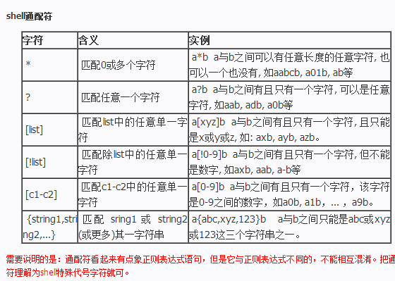
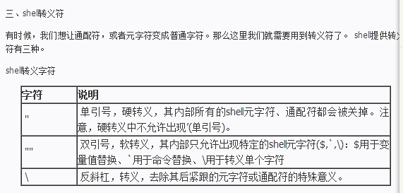
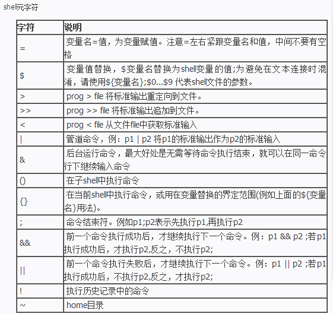

## 一、变量

> 环境变量： 

env 命令可以查看shell下的所有环境变量， 常用的环境变量有:

- HOME: 用户主文件夹
- SHELL: shell使用的是哪一个程序
- HISTSIZE: 是历史命令记录条数有关。 默认是1000
- MAIL:用户取用的mailbox位置
- PATA:执行文件查找的路径
- INPUTRC:与按键功能有关， 可以设置特殊案件
- LANG: 语系数据， 终端显示乱码的时候需要调试（不同语系造成）， 修改方法, 先查看支持多少种语系， 命令 locale –a查找后， 在执行locale 命令进行相应的修改

  

> Linux Shell 通配符、 转义字符、 元字符、 特殊字符

**通配符**

**转义符**

**转义符**

> 常用的一些命令

**打印和设值： **
变量显示 echo 要在变量前加上''
变量设置： unset 或用“=”连接， 用“”或转译符“\”号保持特殊字符原特性； 
如果要在其他子程序中使用， 要增加export 使得他变为环境变量； 
**变量有效范围： **
局部变量=自定义变量； 
全局变量=环境变量， 可以被子进程引用
read： 读取来自键盘的输入变量
declare： 申明变量类型  常用的有“整数数字”“字符串”-默认、 “只读类型”、 “环境变量”、 “数组”——读取方式 ${数组}
**变量删除、 替换**： 

- 删除

'#':从前边开始删除变量内容, 仅仅删除符合替换文字最短的那个
'##':从前边开始删除变量内容, 仅仅删除符合替换文字最短的那个
%:从后面向前删除
表达方式： echo ${path#/*xxx}  其中*xxx是被删除部分

- 替换

`` `auto默认值替换， 如果变量$var没有定义， 则整体值为default字符串， 但var变量本身并没有被设置${var-default}        // 如果var定义了， 但为空， 则还使用$var， 即为空auto` ``

`` `auto${var:-default}          //如果var定义了， 但为空， 则使用default字符串, 默认值设置， 包含默认值替换的所有功能（标准输出一样）， 不同在于， 如果变量$var没有定义， 则在输出default字符串的同时， $var也被设置成default字符串auto` ``
 `${var=default}           //如果var定义了， 但为空， 则还使用$var， 即为空` 

 `${var:=default}           //如果var定义了， 但为空， 则将$var设置成default字符串` **
定向输入， 输出： **
    '>>': 定向输出到指定文件 对标准错误定向输出， 要把准备定向文件的描述符编号放在 > 操作符之前。 例如 kill– l 1234 > /dev/null
2 > & l 放到回收站 "<<": 定向标准输入 **
    管道： **
    linux 可以通过管道连接进程， 之间的数据流可以协调
ps– xo coom | sort | uniq | grep– v sh | more
`` `auto字符串、 环境变量、 参数变量： 字符串有空格要用引号括起来， 等号两边没有空格$HOME	//当前用户主目录$PATH	//用分隔号分开的用来收索的目录  $#		//传递给脚本参数的个数$1, $2..	//脚本程序的参数auto` ``

## 二、数据流定向

> ：以覆盖的方法将『正确的数据』输出到指定的文件或装置上
1> ：以覆盖的方法将『正确的数据』输出到指定的文件或装置上
1>>：以累加的方法将『正确的数据』输出到指定的文件或装置上
2> ：以覆盖的方法将『错误的数据』输出到指定的文件或装置上
2>>：以累加的方法将『错误的数据』输出到指定的文件或装置上
2>& 1：将正确和错误的数据全部写入到指定文件或装置上

<：将原本需要由键盘输入的数据，改由文件内容来取代
<<：代表的是『结束的输入字符』 
<<<:将字符串重定向到stdin。
 
例子：
find /home –name testing >t1.txt 2>t2.txt  将正确输出和错误输出存放在不同文件 
find /home –name testing >t1.txt 2>&1  将正确输出和错误输出存放在t1.txt同文件

**命令执行判断依据**
命令执行判断依据--;,&&,||
在Linux运维过程中或者日常Linux系统操作过程中会同时执行多条命令，这样的话需要通过我们的多重命令方式进行处理。
1.
通过使用';'分号执行多个命令，如例：
`#sync;sync;shutdown -h now`
2.
通过判断执行命令，&&/||执行情况 如例:
**`cmd1&&cmd2:`**
_`若cmd1执行完毕且正确执行($?=0),则开始执行cmd2
若cmd1执行完毕且错误执行($?!=0),则开cmd2不执行`_
**`cmd1||cmd2:`**
_`若cmd1执行完毕后正确执行($?=0),则cmd2不执行。
若cmd1执行完毕后为错误($?!=0),则开始只执行cmd2`_

**管道：**
linux 可以通过管道连接进程，之间的数据流可以协调
`ps –xo coom | sort |uniq | grep –v sh |more`
- 1）管道命令仅为处理标准输出（即正确的输出），对于标准错误输出，将忽略

- 2）管理命令的后一个命令必须能将前一个命令的标准输出变为它的标准输入才可以，如less,more,head,tail就可以，而ls, cp, mv就不行。

**选取命令**
cut - 列选取命令
cut -d '分隔字符' -f 选取的列数
`echo $PATH|cut -d ':' -f 3,5`  --选取第3列和第5列
grep - 行选取命令
grep分一行数据，若当中有我们所需要的信息，则显示该行，否则忽略。
grep [-cinv] '查找的字符串' filename
-c：计算找到的次数
-i：忽略大小写
-v：反向选择
-n：输出第几行

`grep [-acivn] [--color=auto]` ’查找字符串‘ filename
-a: 将binary文件以test文件的方式查找数据；-c:计算找到'查找字符串'的次数；-i：忽略大小写的不同，所以大小写视为相同；-n：顺便输出行号；-v:反向选择，即显示出没有‘查找字符串’内容的一行；--color=auto:可以将找到的关键字部分加上颜色显示
 `last | grep -v 'root' | cut -d ' ' -f1`     
 `grep --color=auto 'MANPATH' /etc/man.config`
排序命令：sort:依据不同的数据类型进行排序,wc：统计,uniq:重复的数据仅列出一个
sort: 使用LANG=C让语系统一，数据排序比较好一点
`sort [-fbMnrtuk] [file or stdin]`
参数：
-f : 忽略大小写；-b ：忽略最前面；-M ：以月份的名字来排序；-n ：使用“纯数字”进行排序；-r：反向排序；-u： 就是uniq,相同的数据中，仅出现一行代表；-t：分隔符，默认[tab]键来分隔； -k ：以那个区间（field）来进行排序的意思
`cat /etc/passwd | sort ; cat /etc/passwd | sort -t ':' -k 3 ; last | cut -d ' ' -f1 | sort uniq [-ic]`
参数：
-i：忽略大小写字符的不同； -c：进行计数
`last | cut -d ' ' -f1 |sort|uniq -c`
`wc [-lwm]`
参数：
-l ： 仅列出行；-w ：仅列出多少字（英文单字）；-m ：仅列出字符
last可以输出登陆者，但最后两行并非账号内容。取得月份登陆系统的总人数
`last | grep [a-zA-Z]|grep -v wtmp|wc -l`
`last | tee last.list | cut -d " " -f1        ;   ls -l | tee -a ~/homefile |more`   (-a,将信息累加而不是覆盖）
字符转换命令： tr,col,join,paste,epand
tr:可以用来删除一段信息当中的文字，或者进行文字信息替换
tr [-ds] SET1 ...
参数：
-d:删除信息当中的SET1Z这个字符串；-s：替换掉重复字符串
`last | tr '[a-z]' '[A-Z]'`
`cat /etc/passwd | tr -d ':'`  将：删除
`cp /etc/passwd /root/passwd && UNIX2dos /root/passwd`
`file /etc/passwd /root/passwd`
`col [-xb]`
参数：
-x:将tab键转换成对等的看空格键；-b ：在文字内有反斜杠（/）时，仅保留反斜杠最后接的那个字符
例如：cat -A 显示所有特殊按钮，最后以col将[tab]转为空白
`cat -A /etc/man.conf`    <==此时看到很多^I的符号，那就是tab
`cat /etc/man.config | col -x | cat -A | more`      [tab]键会转为空格键
join  加入/参加   在处理两个文件之间的数据。将两个文件当中的相同数据那一行加在一起。
`join [-ti12] file1 file2`
参数：
 -t : join默认以空格符分隔数据，并且对比“第一个字段”的数据；-i: 默认忽略大小写 ； -1 ：代表第一个文件要用哪个字段分析的意思 ； -2 ：代表第二个字段用哪个字段来分析
[root@master ssh]# join -t ':' /etc/passwd /etc/shadow 
 paste [-d] file1 file2  直接将两行粘在一起，且中间以[tab]隔开
 参数：
 -d : 后面可以接分隔符，默认以tab来分隔；- ： 如果file部分写成- ，表示来自shandard input 的数据的意思
[root@master ssh]# `paste /etc/passwd /etc/shadow` 
`expand [-t] file`  将[tab]键转成空格
`grep "^MANPATH" /etc/man.config |head -n 3 | expand -t 6 - | cat -A`
切割命令 split    大文件切割成小文件
`split [-bl] file PREFI`

-b ：后面可接欲切割的文件大小，可加单位 例如：b,k,m等；    -l ：以行数来进行切割；
`cd /tmp ; split -b 300k /etc/termcap termcap  ;  ll -k trmcap*`
参数代换： xargs [-0epn] command
参数：
-0 ： 如果输入stdin含有特殊字符，例如`,/ 空格字符时，这个参数可以将它还原成一般符号； -e :EOF，后面接一个字符串，xargs分析到这个字符串时，就会停止工作； -p ： 在执行每个命令的参数时，都会询问用户的意思；-n ：后面接次数，诶次command命令都会执行。
找出具有特殊权限的文件名
`find /sbin -perm +7000 |ls -l`
