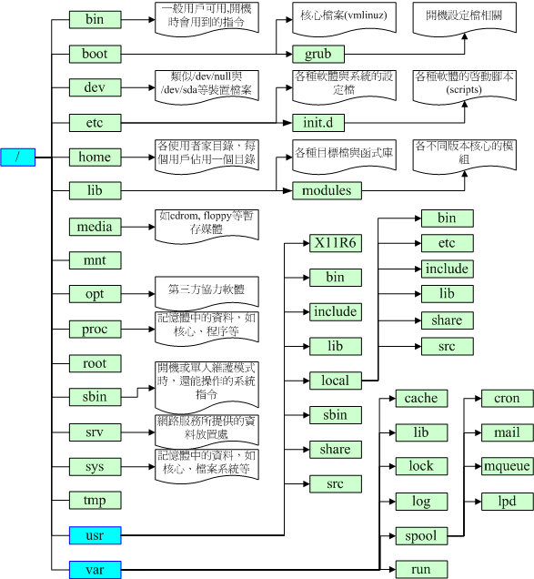

**文件属性**
 查看命令：ls -al
对应：【权限】【连接数】【所有者】【用户组】【文件容量】【修改日期】【文件名】
第一列：文件权限
一共长度为10个字符
第一个字符为：表示”目录、文件、链接“ 以【d】开头是目录；以【-】开头是文件；以【i】开头是链接；以【c】开头是串口端设备
以下的3个字符为一组；第一组是文件所有者的权限、第二组是相同用户组的权限、第三组是其他非相同用户组的权限；
每一组的权限由“rwx”组成，对应为没有的用“-”代替，其中“r”为可读、“w”为可写，“x”为可执行
**改变文件属性&&权限**
命令： 
`chgrp  [-R]  DIR/FIRNAME` ：          递归的改变文件所属于的用户组
`chown   [-R]  账号名 文件or目录`：     递归的改变文件所有者
`chomd   数字类型/符号类型`：           改变文件属性
数字类型  r:4  w:2  x:1  权限分配表
符号类型：`chmod  [u/g/o/a] [+/-/=] [r/w/x]`
第一列表示用户组：拥有着、共同用户组、其他用户、全部用户  ； 第二列表示： 增加、去除、设置 ； 第三列表示权限 

**linux 文件种类和扩展名**
文件种类：普通文件、纯文本文件（ascii）、二进制文件、数据文件（data）、设备文件（device）、链接（link）、接口文件（sockets）
管道（fifo\pipe）
文件扩展名：没有扩展名和文件属性有关
但为方便与win相识

**目录树**
